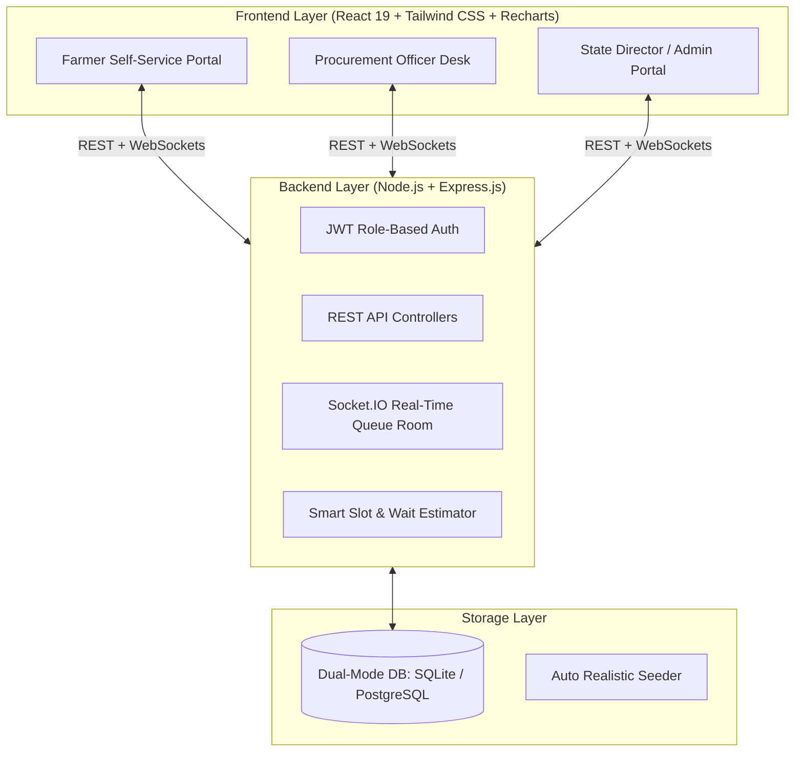

# 🌾 KisanProcure (SIH Problem Statement 26032)
### *Smart Mandi Slot Booking, Real-Time Queue Management & Transparent MSP Disbursement System*

---

## 📌 Executive Summary & Problem Overview

In traditional Indian agricultural mandis, unorganized farmer arrivals cause 6–18 hour physical traffic bottlenecks, distress selling to middlemen, and lack of real-time visibility on procurement progress and MSP payouts.

**KisanProcure** addresses SIH Problem Statement 26032 by providing:
1. **Intelligent Slot Booking & Token Allocation**: Farmers reserve time slots with AI wait-time recommendation to balance traffic loads across mandi centres.
2. **Real-Time WebSocket Queue Tracking**: Powered by Socket.IO, farmers view their live queue position, estimated wait countdown, and receive proximity arrival alerts.
3. **Digital Weighbridge & Quality Grading**: Procurement officers verify farmer tokens, input actual weights (quintals), and test moisture content within permissible limits (&le;12%).
4. **Automated Direct Benefit Transfer (DBT)**: Instant payout calculation at official MSP rates (₹2,425/Qtl for Wheat) with transaction generation and treasury approval.
5. **Government Oversight & Analytics**: High-level KPI monitoring with interactive Recharts trends, centre performance benchmarking, and bottleneck alerts.

---

## 🏛️ System Architecture



---

## 🚀 Quick Start Guide (One Command)

### Prerequisites
- Node.js (v18+)
- npm (v9+)

### 1. Launch Both Backend & Frontend
Run the following command from the root directory:
```bash
npm run dev
```
This concurrently starts:
- 🚀 **Backend API & WebSockets**: `http://localhost:5000`
- 🌐 **Frontend Client**: `http://localhost:5173`

---

## 👥 Demo Personas & Pre-Seeded Accounts

The application includes a **1-Click Demo Persona Bar** at the top of the screen:

| Persona | Name | Role | Pre-Loaded State |
| :--- | :--- | :--- | :--- |
| **👨‍🌾 Farmer** | Ramesh Kumar (`9876543210` / `farmer123`) | `farmer` | Has booked **Token #23** for 40 Quintals of Wheat at Muzaffarpur Central Mandi (5 farmers ahead). |
| **👮 Officer** | Rajesh Sharma (`9876543220` / `officer123`) | `officer` | Managing Desk 1 at Muzaffarpur Central Mandi. Can call next tokens, weigh crops, and grade quality. |
| **🏛️ Admin** | Dr. Sanjay Meena (`9999999999` / `admin123`) | `admin` | State-level oversight, Recharts analytics, centre monitoring, and 1-click DBT disbursement. |

---

## 🎬 Step-by-Step Hackathon Presentation Script (Ramesh Kumar Journey)

1. **Farmer Experience**:
   - Open `http://localhost:5173` and click **"👨‍🌾 Launch as Ramesh Kumar"**.
   - Review **Token #23** in the Upcoming Slot Spotlight.
   - Click **"Live Queue Status"** to view real-time WebSocket queue tracking (Current Token: `#18`, Ramesh: `#23`, ETA: ~28 mins).
2. **Procurement Officer Experience (Open in 2nd Tab/Window)**:
   - In a second tab or window, click **"⚡ Quick Role Switch &rarr; 👮 Rajesh Sharma (Officer)"**.
   - On the Live Desk Control, click **"⚡ CALL NEXT FARMER"** (or Call Token #23).
   - Notice the **instant real-time update in Tab 1** without refreshing the page!
   - Click **"⚖️ WEIGH & VERIFY CROP"**:
     - Actual Weighbridge Reading: `39.5` Quintals
     - Quality Grade: `Grade A (Premium)`
     - Moisture Content: `11.8%` (Permissible)
     - Calculated MSP Payout: `₹95,787.50` (@ ₹2,425/Qtl)
     - Click **"Confirm Procurement & Pay"**.
3. **Farmer Payout Notification**:
   - Switch back to Tab 1: Notice the instant celebratory toast alert: *"🌾 Procurement Verified & Payment Initiated!"*
   - Navigate to **"My Bookings / Procurement Status"** to view the full 6-step lifecycle timeline and official printable certificate.
4. **Government Analytics & DBT Clearance**:
   - Switch to **"🏛️ Dr. Sanjay Meena (Director)"**.
   - Inspect macro KPIs (`12,450+` registered farmers, `8,420.5 Qtl` procured, `₹2.04 Cr` payouts).
   - Under **Direct Benefit Transfer (DBT) Disbursements**, click **"⚡ Disburse (DBT)"** to complete the final transaction.

---

## 📊 Database Entities

1. `users`: Role-based authentication credentials (`farmer`, `officer`, `admin`).
2. `farmers`: Farmer ID (`FARM1001`), landholding, village, masked bank/aadhaar.
3. `procurement_centres`: Mandi location, capacity, coordinates, active token.
4. `crops`: Supported agricultural commodities with MSP benchmark rates.
5. `slots`: Time intervals (e.g. `10:00 - 11:00 AM`) with capacity reservation counters.
6. `bookings`: Assigned token numbers, status (`booked`, `in_progress`, `completed`).
7. `queue_state`: Real-time serving token index per centre.
8. `procurements`: Physical weighbridge readings, quality grades, moisture %.
9. `payments`: MSP disbursement records, transaction IDs (`TXN-XXXX`), DBT state.
10. `notifications`: In-app proximity alerts and SMS payload logs.

---

## 🛠️ Technology Stack

- **Frontend**: React 19, Tailwind CSS v4, Lucide React, Recharts, Canvas-Confetti, Axios, Socket.IO Client.
- **Backend**: Node.js, Express.js, Socket.IO, JWT, BcryptJS, Better-SQLite3 / PostgreSQL adapter.
- **Languages**: JavaScript (Fullstack), SQL, HTML5/CSS3.
- **UI Localization**: English & Hindi (हिन्दी) dual-language support.
